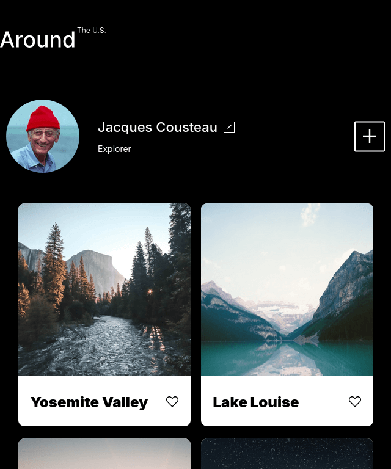
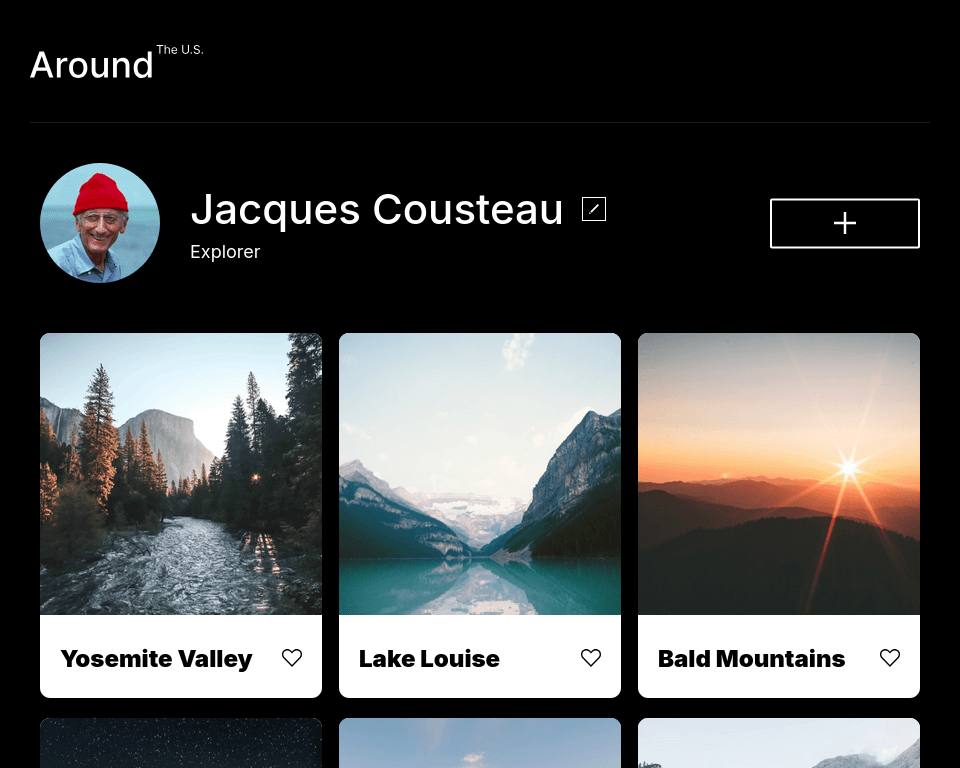
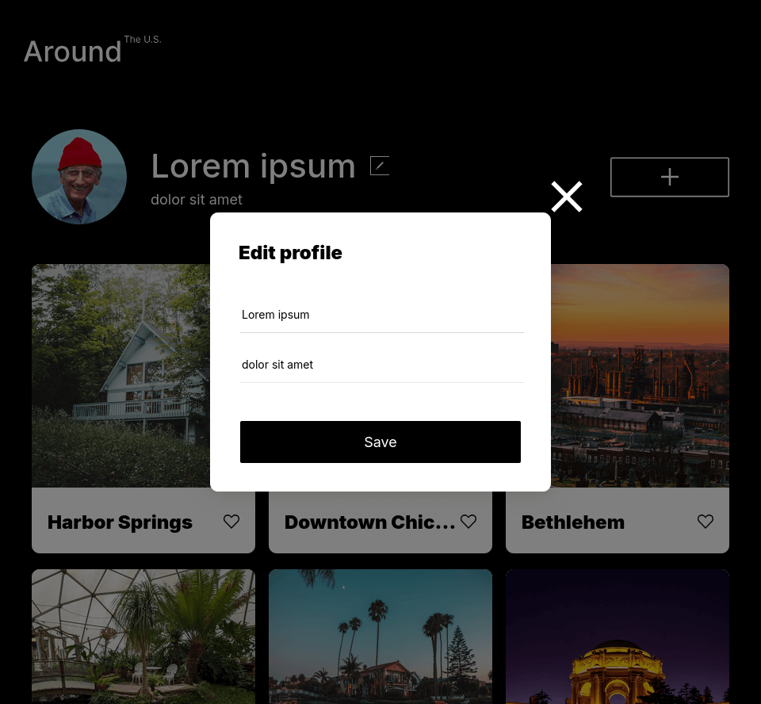
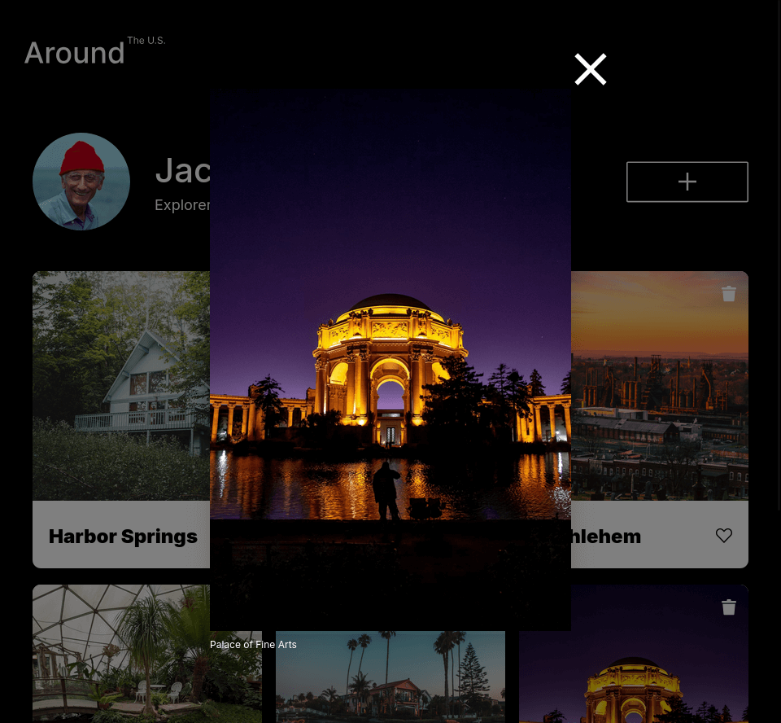
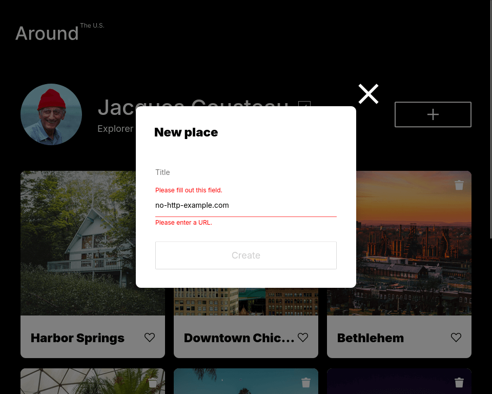

# TripleTen Project 3: Around The U.S.

This project made by [TripleTen](https://tripleten.co.il) is about a website called "Around The U.S." - an image portfolio website dedicated to showcase the places and views around the USA, and even adding some interactivity by allowing to add or remove images from the gallery.

This website was made with responsive design in mind, providing navigation and accessibility with devices besides just mobile or desktop web browsers. This was made possible thanks to a combo of media queries and flexible elements such as the CSS grid.

## Techs used

- HTML5
- CSS
- JavaScript
- Flexbox
- Grid
- Media queries
- The BEM methodology (page blocks + flat files)
- Forms
- Form validation (primarily via JS)
- Event listeners
- Object-Oriented Programming paradigm
- Class modules (loose coupling)
- NodeJS & Webpack deployment
- API calls

## Previews

### [Website link](https://pragmaticLudusian.github.io/se_project_aroundtheus)

### Mobile

### Tablet

### Desktop

### Video

[**Sprint 9 - Youtube link**](https://youtu.be/-d1Hk_sM61M)

[Sprint 3 - Google Drive (outdated)](https://drive.google.com/file/d/1Ubwb2TJiIOi9OMVTyT707nrn7GscelmX/view?usp=drive_link)

## Resources

### Figma blueprints

- [Figma link I - base design](https://www.figma.com/file/Es8zZP3ARGH9JGcw60i3OD/Sprint-3_-Around-the-US?node-id=6432%3A147&t=7oYKsnPJeNJQDFCB-1)
  - [Alt. link in case the above's overloaded](https://www.figma.com/file/ii4xxsJ0ghevUOcssTlHZv/Sprint-3%3A-Around-the-US?node-id=0%3A1)
- [Figma link II - modal design](https://www.figma.com/file/EO5AaNCuzzFL7X5gSY7HwQ/Sprint-4_-Around-The-U.S.-_-desktop-%2B-mobile?t=3hvVWRz9LUFsxyNn-6)
- [Figma link III - modal design continued](<https://www.figma.com/file/JFPhASqvZ5pBjQV2ouUlim/Sprint-5_-Around-The-U.S.-_-desktop-%2B-mobile-(Copy)?t=3hvVWRz9LUFsxyNn-6>)
- [Figma link IV - form validation design](https://www.figma.com/file/N3zUeequnpvMX807FfYAZW/Sprint-6-Around-The-U.S.?node-id=0-1&t=88iVO80aevkZBggI-0)
- [Figma link V - more modal designs and API rendering](https://www.figma.com/design/xQVeb8gprjukPVKXiLXS5T/Sprint-9%3A-Applied-JavaScript?node-id=1-177&node-type=frame&t=QTdL17iMSJRiqGUZ-0)

### API used

- https://around-api.en.tripleten-services.com/v1
