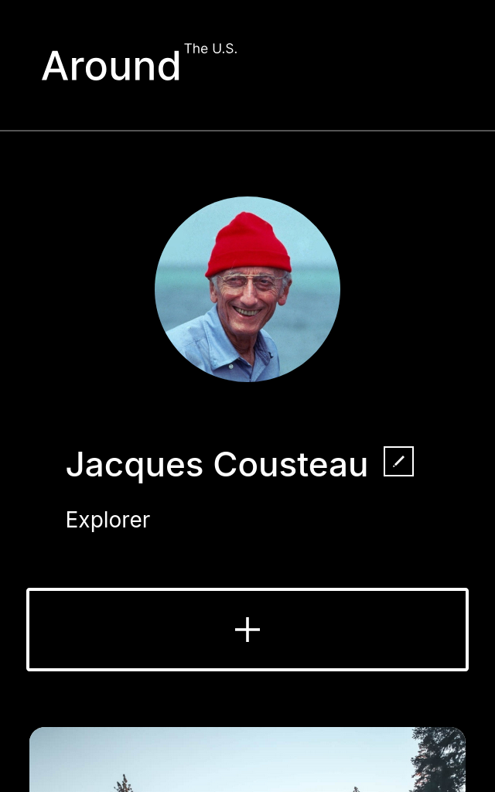

# TripleTen Project 3: Around The U.S.

This project made by [TripleTen](https://tripleten.co.il) is about a website called "Around The U.S." - an image portfolio website dedicated to showcase the places and views around the USA, and even adding some interactivity by allowing to add or remove images from the gallery.

This website was made with responsive design in mind, providing navigation and accessiblity with devices besides just mobile or desktop web browsers. This was made possible thanks to a combo of media queries and flexible elements such as the CSS grid.

## Techs used

- HTML5
- CSS
- Flexbox
- Grid
- Media queries
- The BEM methodology (pages + flat files)

## Previews

### [Website link](https://pragmaticLudusian.github.io/se_project_aroundtheus)

### Mobile

### Tablet

### Desktop

### Video

[Link's in the Google Drive](https://drive.google.com/file/d/15dxpdWaq9NFDU2au3w3Y2PKEp8nig48a/view?usp=drive_link)

## Resources

- [Link to project on Figma](https://www.figma.com/file/Es8zZP3ARGH9JGcw60i3OD/Sprint-3_-Around-the-US?node-id=6432%3A147&t=7oYKsnPJeNJQDFCB-1)
- [Alt. link in case the above's overloaded](https://www.figma.com/file/ii4xxsJ0ghevUOcssTlHZv/Sprint-3%3A-Around-the-US?node-id=0%3A1)
